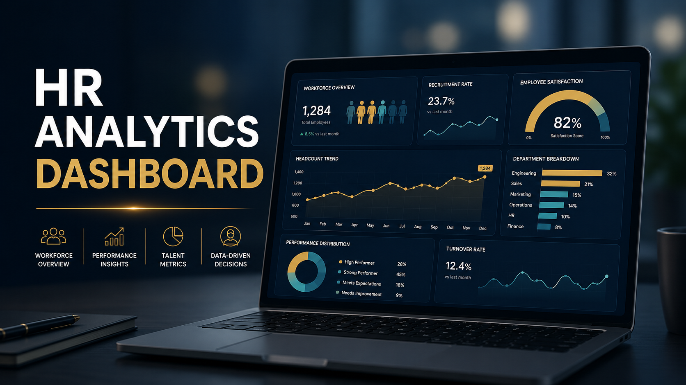
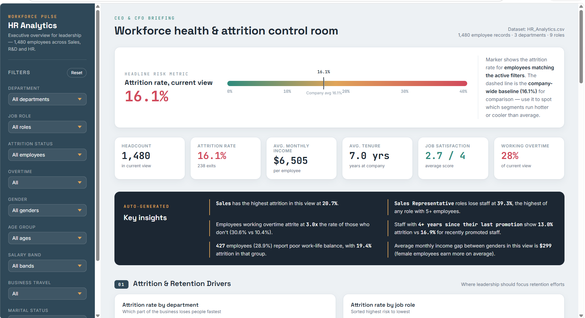
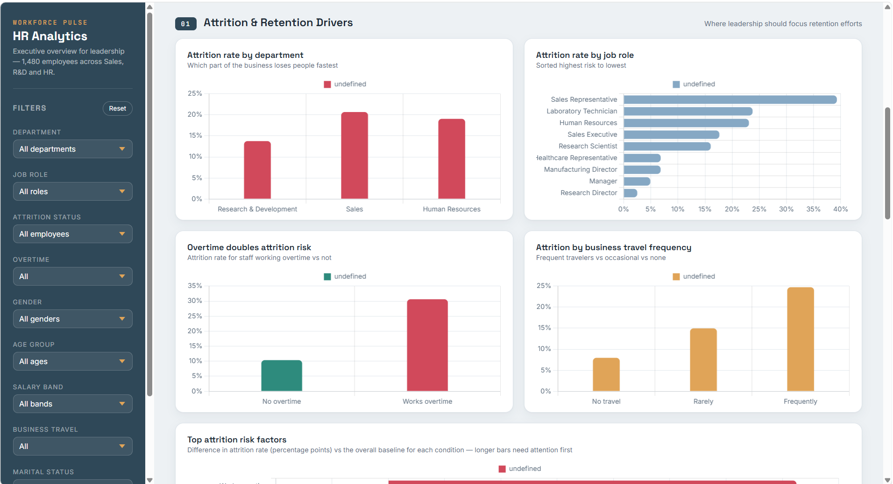
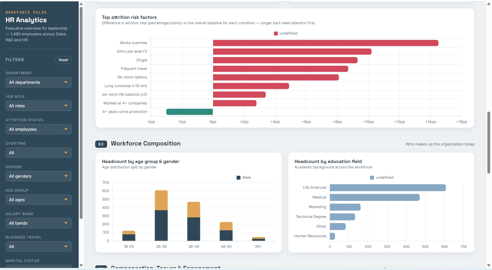
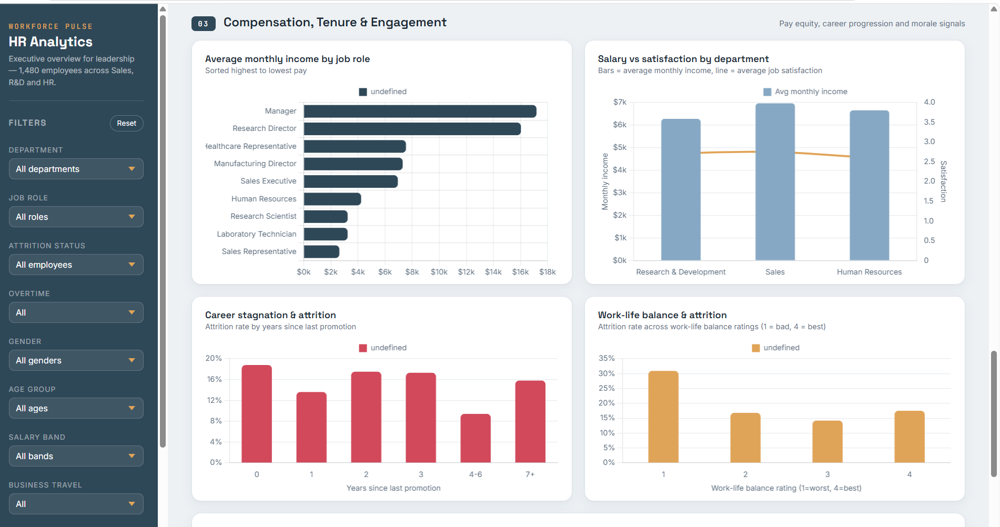
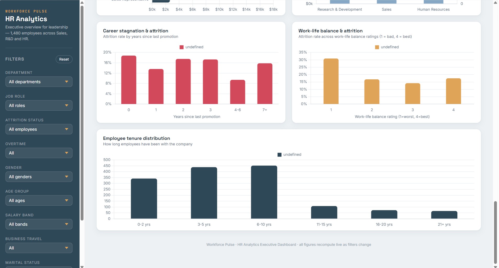

 # 📊 HR Analytics Dashboard

A comprehensive **HR Analytics Dashboard** built to help organizations analyze workforce data, monitor employee performance, understand attrition trends, and support data-driven HR decision-making.

The dashboard provides interactive visualizations that enable HR professionals to identify workforce patterns, improve employee retention, and optimize organizational performance.

---

## 🚀 Project Overview

The HR Analytics Dashboard transforms raw HR data into meaningful business insights through interactive charts, KPIs, and visual reports.

This dashboard helps organizations answer questions such as:

- What is the employee attrition rate?
- Which departments have the highest turnover?
- How does employee satisfaction impact attrition?
- What are the workforce demographics?
- Which job roles require attention?
- How can HR improve employee retention?

---

# 📌 Key Features

- 📈 Employee Attrition Analysis
- 👨‍💼 Department-wise Employee Distribution
- 💰 Salary Analysis
- 🎓 Education & Qualification Insights
- 👥 Gender Diversity Analysis
- 📅 Age Group Distribution
- ⭐ Job Satisfaction Analysis
- 🏢 Business Travel Insights
- 📊 Interactive KPI Cards
- 📉 Dynamic Visualizations
- 🔍 Data Filtering & Drill-down

---

# 🛠️ Technologies Used

- Power BI
- Microsoft Excel
- Data Cleaning
- Data Visualization
- HR Analytics
- Business Intelligence

---

# 📊 Dashboard KPIs

- Total Employees
- Active Employees
- Attrition Count
- Attrition Rate
- Average Age
- Average Salary
- Average Years at Company
- Job Satisfaction Score

---

# 📷 Dashboard Screenshots

## Dashboard 1



---

## Dashboard 2



---

## Dashboard 3



---

## Dashboard 4



---

## Dashboard 5



---

# 📈 Business Insights

The dashboard provides valuable insights including:

- Employee attrition trends across departments.
- Salary distribution by job role.
- Gender diversity statistics.
- Employee age demographics.
- Education level analysis.
- Job satisfaction comparison.
- Department performance metrics.
- Workforce composition analysis.

---

# 🎯 Business Benefits

- Improve employee retention
- Support HR decision-making
- Identify high-risk departments
- Optimize workforce planning
- Monitor employee satisfaction
- Analyze recruitment effectiveness
- Enhance organizational productivity

---

# 📂 Project Structure

```
HR-Analytics-Dashboard/
│
├── Dashboard.pbix
├── HR_Analytics_Dataset.xlsx
├── README.md
│
├── images/
│   ├── 1.png
│   ├── 2.png
│   ├── 3.png
│   ├── 4.png
│   └── 5.png
│
└── Assets/
```

---

# 💡 Future Enhancements

- Predictive Attrition Analysis using Machine Learning
- Real-time HR Dashboard
- Employee Performance Forecasting
- Automated HR Reports
- AI-powered Workforce Insights

---

# 👨‍💻 Author

**Ashutosh Singh**

AI & Machine Learning Engineer

- Python
- SQL
- Power BI
- Data Analytics
- Machine Learning
- Deep Learning
- Business Intelligence

---

## ⭐ If you found this project helpful, don't forget to Star ⭐ the repository!
